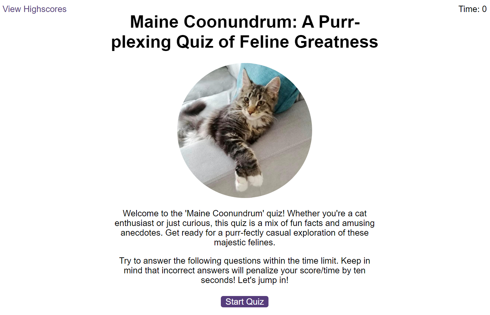
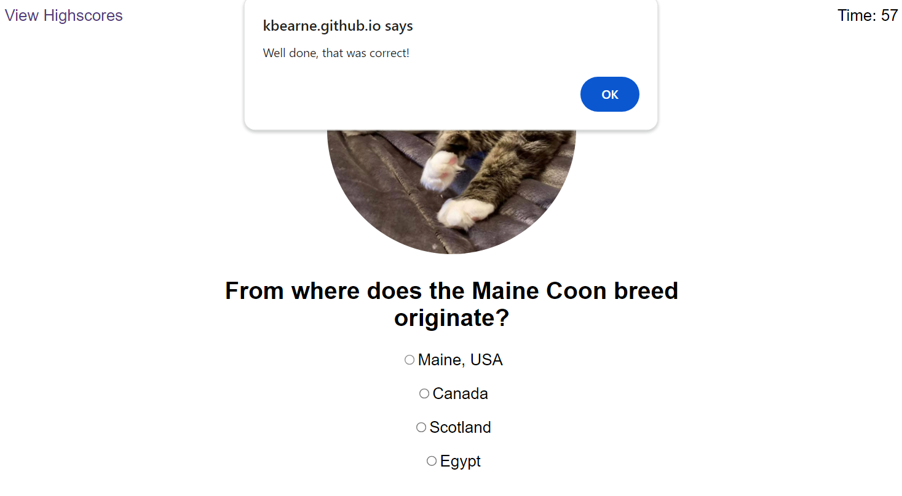
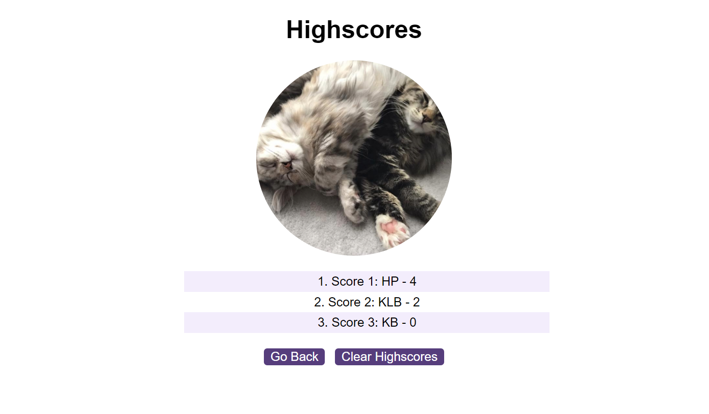

# Code-Quiz-Kelly-Bearne

## Description

This project fullfils the criteria of building a browser application that allows users to take a timed quiz of multiple choice questions. It features dynamically updated HTML and CSS (powered by JavaScript code) and has a clean and responsive user interface. At the end of the quiz users can store their initials together with their highscore, which is then displayed to them (on a highscores page) ordered by rank.

## Installation

N/A

## Usage

Access the deployed application at the following URL: https://kbearne.github.io/Code-Quiz-Kelly-Bearne

This application runs in the browser and allows users to take a timed quiz lasting 90 seconds (triggered by clicking the 'Start' button on the homepage).

For incorrect answers, 10 seconds are deducted from the timer. For correct answers, the users score is incremented. Once an answer is selected (via radio checkbox), the answer is locked in and the ability to select an alternative answer for that question is disabled.

When time runs out, or all questions are answered (whichever comes first), the quiz ends and the final score is displayed to the user along with an input field to enter initials. Finally, once the user enters their initials, they will be shown a list of ranked highscores.

Highscores are stored persistantly in the browser using local storage (via JavaScript).

## Built with

  

## License

MIT license

## Credits

Credit to https://www.favicon.cc/?action=icon&file_id=910289 for the favicon